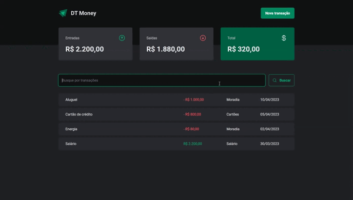

# DT Money

DT Money is a fictional financial management application built with React and TypeScript. It serves as a personal finance tracker to help users manage their income, expenses, and transactions. This project was developed to improve skills in web development and demonstrate proficiency in using technologies such as Styled Components, React Hook Form, Zod, and HookForm/Resolver.

  

## Features

- **Income and Expense Tracking:** DT Money allows you to keep track of your income and expenses, categorizing your transactions to gain insights into your financial activities.

- **Transaction History:** The application provides a transaction history, giving you a clear overview of your financial records.

- **Add New Transactions:** Easily add new income or expense transactions to your account.

- **Search Transactions:** Search and filter transactions by type, description, date, and price to quickly find specific entries.

## Technologies Used

DT Money leverages various technologies and libraries, including:

- React
- TypeScript
- Styled Components
- React Hook Form
- Zod
- HookForm/Resolver
- JSON Server (for storing transaction data)
